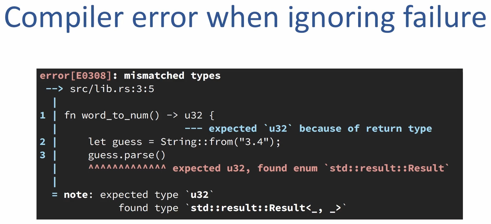
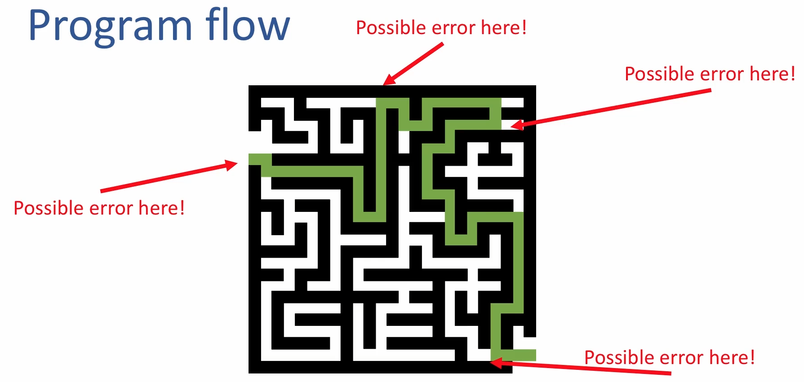
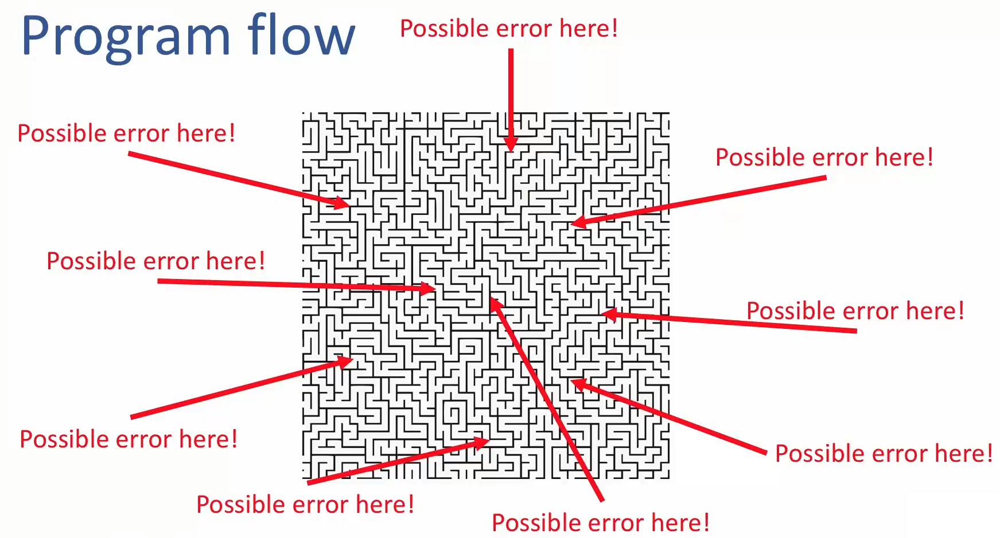
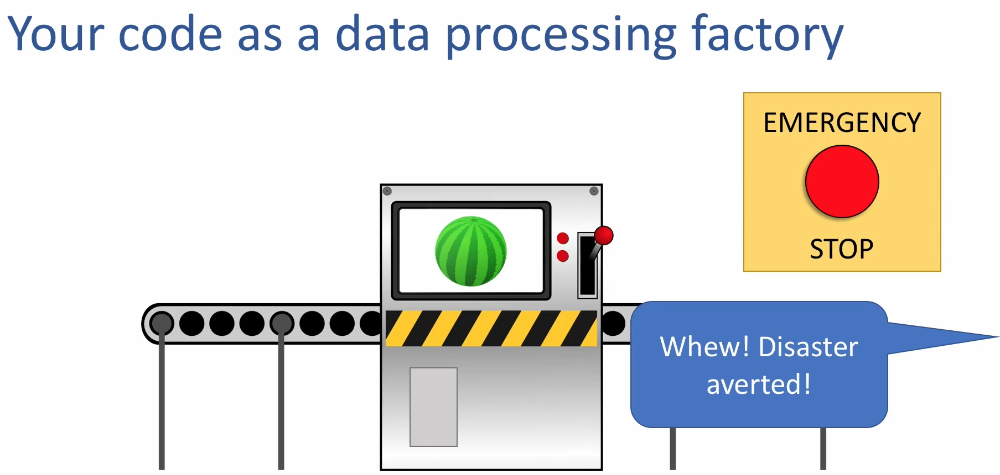

# Error handling in Rust

- Whatever we try but still errors will happen
  - Errors include
    - programming bugs - E.g., out of bound access
    - Network timeout - E.g., interactions with systems outside of our control that don't go as planned
    - Unexpected input - E.g., entering alphabets where a numeric is needed
- Effect of forgetting to handle errors
  - Frusturating the end users
  - Unintended consiequences
  - Security vulnerabilities
- Rust is designed as
  - **Erros are a possibility** and
  - **to handle them appropriately**
  - Example:
    - Type System
      - Type system indicates when an operation might fail and the compiler won't let you ignore a possible failure
      - 

- Appropriate error handling
  - Stopping the program
  - Attempting to recover
  - Using default values
  - Propagating the error
  - Notifying the user

- Rust error handling philosophy
  - Wehn you first start a prototype
    - You are mostly concerned with getting the happy path to work
      - 
    - In the long term (and for larger rust programs)
      - Rust strategy for error handling error goes a long way towards making more reliable programs
      - 

- Idomatic ways to deal with errors in Rust
  - Panicking when something goes wrong
    - `panic!` macro
  - Handling `Results` and `Options`
    - These are standard library types
    - Indicates when a function returns
  - Writing a function that returns `Results` and using `?`
- Advantages of Rust's error handling strategy
- Custom error types
  - You can make your own custom error types
- Error handling crates
  - How crates makes working with errors easier
- Useful methods on `Result` and `Option` types

## panic-macro

- Panic concept
  - Analogy:
    - your data processing thread receives an invalid input
      - If we continue processing the data, and process the data like valid data
        - Result may be undefined (processed data is a garbage)
        - And may lead to security vulnerability
    - It is better to stop the program instead of continuing
      - Panicking is like a emergency stop button
      - `panic!` stops the thread immediately of what it is doing to avoid damage
    - 

  - Example: Command Line Application
    - Can process data for Windows, Linux, macOS
      - Specified with a `-p` flag
        - `$./my-program -p macos`
          - What the program should do if the user enters `-p oranges` or there is a typo `mac0s`
            - The entered value is not one of the OS supported by the program
            - It is best to panic
              - *`thread 'main' panicked at 'explicit panic', src/main.rs:2:5`*

- How to use `panic!` macro

  - Example 1 : Just panic

    ```rust
    fn main() {
        panic!();
    }

    // thread 'main' panicked at 'explicit panic', src/main.rs:2:5
    ```

  - Example 2: Panic with our custom message

    ```rust
    fn main() {
        panic!("Something is not right");
    }

    // thread 'main' panicked at 'Something is not right', src/main.rs:2:5
    ```

  - Example 3: can use aguments like `println!`

    ```rust
    fn main() {
        let _age = "test";
        panic!("Age should be numeric, but found alphabets[{}]", _age);
    }

    // thread 'main' panicked at 'Age should be numeric, but found alphabets[test]', src/main.rs:3:5
    ```

  - Example 4: Command Line Application

    ```rust
    #[derive(Debug)]
    enum Platform {
        Windows,
        Linux,
        MacOS,
    }

    impl Platform {
        fn parse(platform_arg: &str) -> Platform {
            if platform_arg == "windows" {
                Platform::Windows
            } else if platform_arg == "linux" {
                Platform::Linux
            } else if platform_arg == "macos" {
                Platform::MacOS
            } else {
                panic!("Unknown platform: {}. Value values: windows, linux, macos", platform_arg);
            }
        }
    }

    fn main() {
        let platform_arg = "wind0ws" ;
        let platform = Platform::parse(platform_arg);
        println!("Producing output for {:?}", platform)
    }

    // thread 'main' panicked at 'Unknown platform: wind0ws. Value values: windows, linux, macos', src/main.rs:17:13
    ```

- Situations in which to panic
- Other macros that call `panic!`
