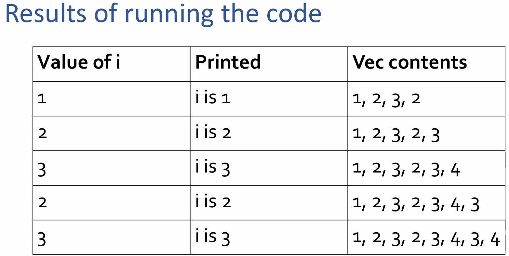
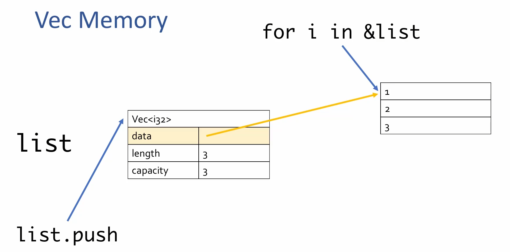
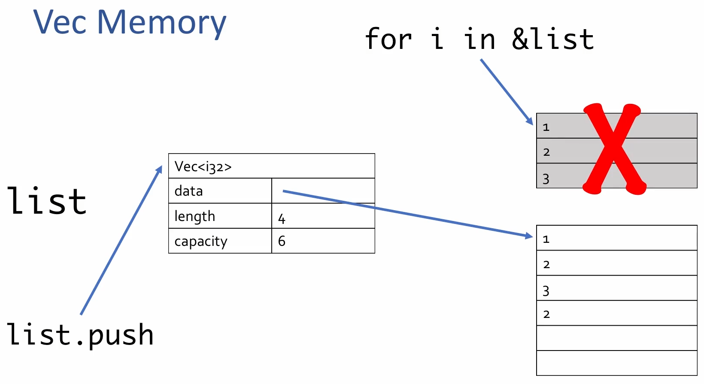
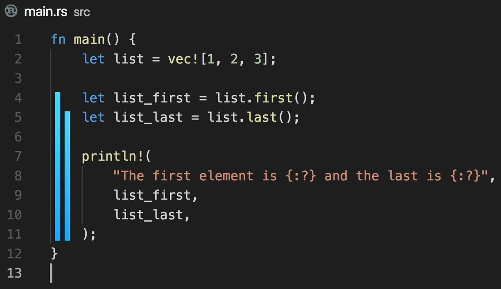
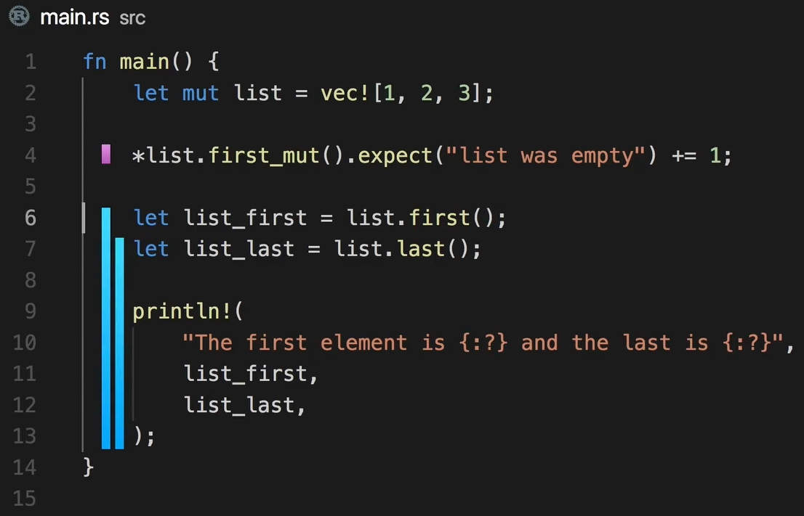
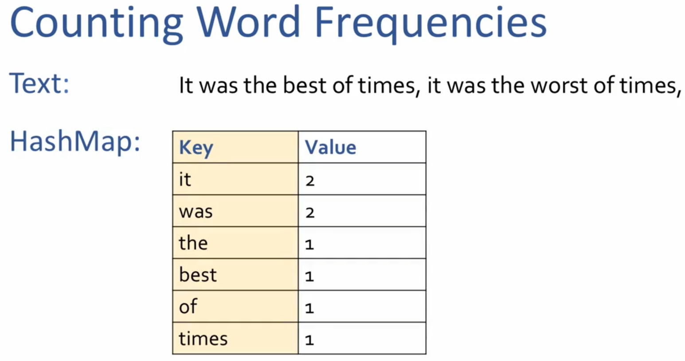
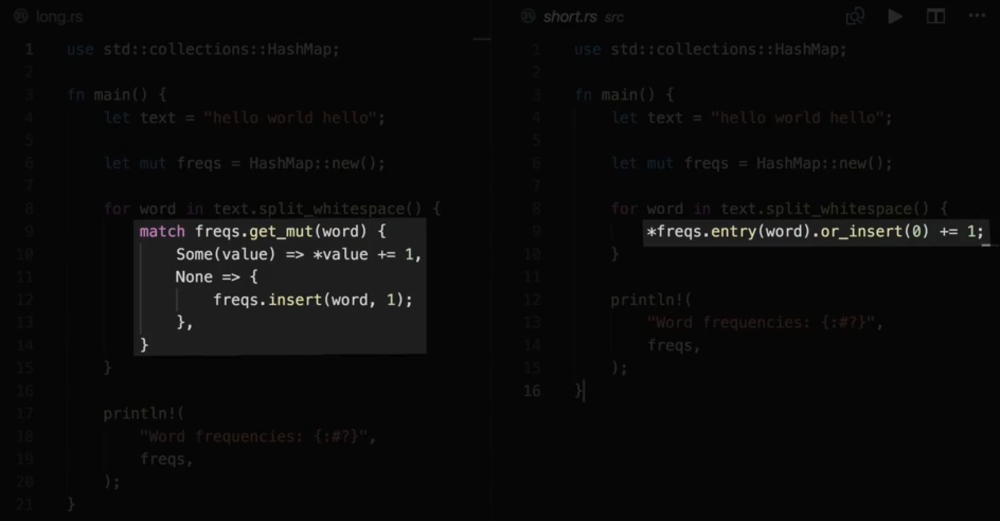
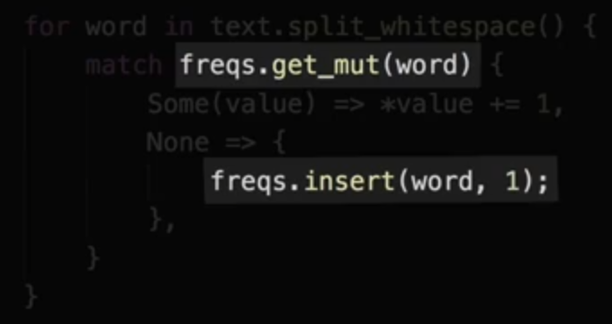
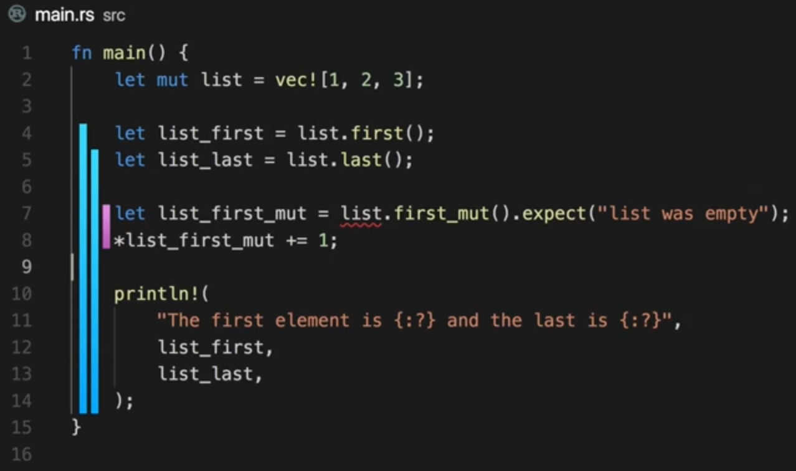

# Owernership and Borrowing

- This ownership and borrowing is a memory management concept that provides memory safety gurantee in Rust

## Ownership

- Definition of ownership
  - Rust's strategy of managing memory
- How ownership differs from:
  - Manual memory management in C
  - Garbage collection in Ruby
- Example: The `String` data type in Rust
  - Moving ownership
    - From one function to another
  - Cloning data
    - Basically duplicating it, to have two separate owners
- Execise with functions and strings

### What is ownership

- It is Rust's strategy for managing data and memory and preventing common problems
- Each piece of data has one owning variable, the memory owner
- Owner is responsible for cleaning up that data and no one else
  - Cleanup happens when the owner goes out of scope
- The owner decides on mutability

### How ownership differs from `C` / `Ruby` / `Rust`

- In `C`
  - *Basically manual memory management*
  - Code has to explicitly has to perform both allocation and deallocation
    - `malloc`, `free`
  - Advantage
    - Complete control over your program memory and how much it uses
  - Disadvantage
    - C doesn't prevent you from messing with pointers
      - Use after free
        - dangling pointers
      - Memory leaks
        - if deallocation is not done by the program
      - Double free
        - Two parts of your program tries to dealloate the same data
  - These disadvantages cause major security flaws and crashes
    - Example: Heartbleed vulnerability

    ```c
    #include <stdio.h>
    #include <stdlib.h>

    typedef struct tagNode {
      char cLeftChannel;
      char cRightChannel;
      char cValue;
    } NODE;

    int main(int argc, char *argv[]) {
      /* manually allocate */
      NODE * pNode = malloc(sizeof(NODE));
      
      pNode->cLeftChannel = 0;
      pNode->cRightChannel = 0;
      pNode->cValue = 10;

      /* manually deallocate */
      free(pNode);

      return 0;
    }
    ```

- In `Ruby`
  - *Basically automatic memory management*
  - It takes care of managing memory
    - By garbage collector
      - It is a component running alongside your program, cleaning up memory that you are done wtih
    - Advantage
      - No need to think about managing memeory at all
      - GC keeps trackof which memory is still in use and cleans up any data that your program is done with
      - And we don't have the disadvantages listed for 'C"
    - Disadvantage
      - Down side of GC is you lose control and performance
        - When GC runs,
          - It takes up computer resources that your program could be using
          - Your program will also likely use more memory than it strictly needs because of the GC (Because GC cleans up only if it is sure that your program is done)
- `Rust`
  - It tries to get the **best of both worlds**
    - Ownership gives you *control over memory allocation*
      - and the associated performance by cleaning up data ***automatically*** when owner goes out of scope
  - We *can't mess up with memory acess*, and
  - We *won't be using memory longer* than we strictly need to

### Example: The String data type

#### String

- It is a type in Rust that has data that needs to be cleaned up when it goes out of scope
- It tracks
  - How much space is allocated
  - how much of that space is used
  - And the UTF-8 data
- When the owner of the string goes out of scope
  - The UTF-8 data needs to be cleaned up

- Creating String

    ```rust
    fn main() {
        let a = String::from("Hi");
        println!("Salutation string {}", a);
    }
    ```

  - `let a = String::from("Hi");`
    - String allocates memory to hold the text "hello"
  - `println!("Salution string {}", a);`
    - It uses the value of `a` for printing
  - When code reaches the closing curly braces `}`
    - At this point, variable `a` goes out of scope
    - The data allocated for `a` is deallocated automatically

  ```rust
  fn main() {
      let mut a = String::from("Hi");
      a.push_str(", Good Morning!!!");
      println!("Salutation string {}", a);
  }

  // Salution string Hi, Good Morning!!!
  ```

  - data can be modified dynamically (variable needs to be mutable `mut`)
    - `a.push_str(", Good Morning!!!");`
      - This will allocate more memory if necessary

### Moving Ownership

- By default, for non-primitive types, rust moves the ownership
- Between variables

    ```rust
    fn main() {
        let a = String::from("Hi");
        let t = a;
        println!("Salution string {}", t);
    }

    // Salution string Hi
    ```

  - `let t = a;`
    - This will move ownership of the string `a` to `t`
      - After this, the variable `a` is no longer available for use
- Between functions

  ```rust
  fn greet(s: String) {
      println!("Hi, {}", s);
  }

  fn main() {
      let a = String::from("Good Morning");
      greet(a);
  }

  // Hi, Good Morning
  ```

  - function `greet` takes ownership of string and prints it out
  - The string `s` gets cleaned-up at the end of function `greet`
- Transferring ownership from function

  ```rust
  fn smiley_open_hands() -> String{
      String::from("🤗")
  }

  fn main() {
      let s = smiley_open_hands();
      println!("String val: {}", s);
  }

  // String val: 🤗
  ```

- Here the ownership of the string created in `smiley_open_hands` is transferred to the function caller
  - It is not cleanedup at the end of the function `smiley_open_hands`
  - Instead ownership is transferred to `a` and it is cleaned-up at the end of `main` when `a` goes out of scope

### Cloning data

- Sometimes we need to keep the ownership of the data but also need to give ownership of the data to another piece of code
  - This is done by *cloning*
- `let t = a.clone();`
  - Cloning makes
    - a deep copy of the allocated memory
    - There is two copies of data owned by each owner `a` and `t` respectively
      - Now each owner has the responsibility to clean up their data
- Cloning is one of the way to overcome errors arised from ownership
  - But we may end up using more memory than we strictly needed

    ```rust
    fn greet(s: String) {
        println!("Hi, {}", s);
    }

    fn main() {
        let a = String::from("Good Morning");
        greet(a.clone());
        println!("Using a again: {}", a);
    }

    // Hi, Good Morning
    // Using a again: Good Morning
    ```

### Fun with functions and strings

```rust
fn main() {
    let s = String::from(:book);

    // Add code here that calls the pluralize function

    println!(
        "I have one {}, you have two {}",
        s,
        you_add_something_ehere,
    );
}

// Add appropriate parameters, return values, and implementations to this function
fn pluralize() {}
```

Solution:

```rust
fn main() {
    let s = String::from("book");

    let pl = pluralize(s.clone());
    println!("I have one {}, you have two {}", s, pl);
}

// Add appropriate parameters, return values, and implementations to this function
fn pluralize(singular: String) -> String {
    singular + "s"
}
```

## Borrowing

- What is borrowing?
  - *Lend out a value instead of transferring ownership*
  - It is a way to allow some code to use a value without moving ownership

    ```rust
    struct Person {
        name: String,
    }

    fn congratulate(person: &Person) {
        println!("Congratulations, {}!!!", person.name)
    }

    fn main() {
        let p = Person {
            name: String::from("Gymk"),
        };

        congratulate(&p);
        println!("Can still use p here: {}", p.name);
    }

    // Congratulations, Gymk!!!
    // Can still use p here: Gymk
    ```

  - In above code, `congratulate` function just reads the person name
  - it doesn't need the ownership, just borrowing it is enough to print it
    - This is indicated by the `&` before the type name
    - Note that also we use `&` in the caller also to indicate that it is a reference
- Why borrow?
  - *Reduce allocations; improve performance*
  - Reason is **performance**
    - Instead of cloning the value, we can give it a reference to use it
    - This avoids cloning, yielding performance
      - That is Rust uses borrowing to reduce the allocations to improve the performance
  - Borrow is a signal of intent
    - If the function signature has `&`, then we can know that the function do not want to change the data of it, instead to use it
      - `pub fn push_str(&mut self, string: &str)`
- Difference between borrowing and pointers in other languages
  - In Rust, *references are always valid*
  - Borowing may feel similar to using pointers in other langauges
    - But there ***are*** important differences in Rust. There is one bug important difference
      - In Safe Rust, the borrow checker ensures at compile time, that you will never have an invalid reference (a reference that points to nothing or to invalid memory)
      - This prevents a lot of bugs
        - Example: Run time bug caused by invalid reference
          - Ex: `C` or `C++`
            - *Segmentation Fault*
          - Ex: `Ruby`
            - *Undefined method on nil*
          - Ex: `JavaScript`
            - *Undefined is not a function*
        - These run time errors happens only in certain circumstances and hard to debug/track down
        - This is avoided by compile time borrow checker in Rust
          - Rust catches these errors every time and won't let you try to even run the code with this problem
  - Example: Trying to create an invalid reference in Rust

    ```rust
    fn name() -> &str {
        let n = String::from("Gymk");
        &n
    }

    fn main() {
        let my_name = name();
    }
    ```

  - In function `name`
    - `n` is the owner of the string that is created
    - and this `n` goes out of scope at the end of the function `name`
  - Rust doesn't allow to return a refernce to `n` which is going to get destroyed
    - Because once out of scope, there is nothing to reference to once the function is over
    - If we were able to, then `my_name` will have an invalid reference
  - *You can't return a reference from a function that points to something that points to something that was created within that function*
  - Solution

    ```rust
    fn name() -> String {
        String::from("Gymk")
    }

    fn main() {
        let my_name = name();
    }
    ```

- Alternate solution to [execise](#fun-with-functions-and-strings)

    ```rust
    fn main() {
        let s = String::from("book");

        let pl = pluralize(&s);
        println!("I have one {}, you have two {}", s, pl);
    }

    // Add appropriate parameters, return values, and implementations to this function
    fn pluralize(singular: &str) -> String {
        singular.to_owned() + "s"
    }

    // I have one book, you have two books
    ```

  - string slices `&str` are borrowed and can't reallocate
    - We are using `to_owned()` to create a new string from the slice and the we perform the string concatenation
  - This solution is not right, even though we removed `clone` during the `pluralize` invokation, but it clones the string inside `pluralize`
    - However, the concern of allocation is moved to pluralize, removing the worry from the caller - a good design approach
      - That is ***encapsulated*** the implementation detail within the `pluralize` function

### Slices

- Slice is a borrowed data

- What is a slice?
  - *Borrow a slice of data*
  - It is a data type that always borrow data owned by some other data structure
  - In below picture,
    - How a slice is stored -> A pointer and length
    - The reference that slice referencess -> a reference to `ll` in the `hello` string
      - 
- How to create a slice from Strings, Vecs, or arrays?
  - `&var[start..end]`
  - `String`
    - `&` and a range `[start_index..end_index]`
    -   
    - If you want to start from index '0', the you can `[..4]`
      - `let s_slice = &s[..4]`
    - If slice goes till end of the data strucut, then you can `[1..]`
      - `let s_slice = &s[1..]`
    - If slice borrows all of the data, then you can `[..]`
      - `let s = &s[..]`
  - array and `Vec`
    - `let a = [0.0, 3.14, -8.7928];`
      - Slice from `a`: `let a_slice = &a[..1];`
    - `let mut v = vec![10, 20, 30]; v.push(40);`
      - Slice from `v`: `let v_slice = &v[1..2];`
- Indices in slices
  - Slices
    - Are always valid references
      - The borrow checker ensures slices are always valid
    - Have their indices checked at runtime
      - But, at run time, Rust will panice and stop your program if slice indices are out of bounds
      - ***This is done at run time, not a compile time***
      - Example:

        ```rust
        fn main () {
            let v= vec![10, 20, 30];
            let v_slice = &v[..9];
            println!("v_slice is {:?}", v_slice);
        }

        // thread 'main' panicked at 'range end index 9 out of range for slice of length 3', src/main.rs:3:20
        // note: run with `RUST_BACKTRACE=1` environment variable to display a backtrace
        ```
  
        - *Slice indices are not analyzed at compile time*
          - Even though out of bound value `9` is used in the range, rust compile won't analyze the indices (as in real use case, the indice range may be dictated by some other variable value)
          - However, rust panics and stops the program, this *prevents the use of invalid memory*, which will lead to *segmentation fault* or *undefined behaviour*.
      - String Slices
        - **It has additional protection**
          - *The character boundaries are checked at run-time*
          - *Must occur at valid Unicode character boundaries*
        - The indices of the slice range must be at valid Unicode character boundaries

          ```rust
          fn main() {
              let s = "😊👍🤣😂";
              let s_slice = &s[0..1];
              println!("s_slice is: {:?}", s_slice);
          }

          // thread 'main' panicked at 'byte index 1 is not a char boundary; it is inside '😊' (bytes 0..4) of `😊👍🤣😂`', src/main.rs:3:20
          // note: run with `RUST_BACKTRACE=1` environment variable to display a backtrace
          ```

          - Each emoji will use multiple byte. The character boundaries are not checked at compile time
        - Use `String` methods instead of indicies
          - user `chars` or `char_indices` to get a slice, ***DO NOT USE indices***
- String Literals
  - String literatls create string slices.
    - The texts that are provided in your compiled program is created as a slice

    ```rust
    fn main() {
        let s = "hello";
    }
    ```

- Why use slices as paramters?
  - *Flexibility*
  - it is better to use a slice or a string slice as parameters to functions or methods, rathen than borrowing a `Vec` , array, or `String`
    - Example - 1: Using array and `Vec`

      ```rust
      fn main() {
          let a = [1, 2, 3];
          let v = vec![4, 5, 6];
          let v_slice = &v[..];

          only_reference_to_araay(&a);
          only_reference_to_vector(&v);
          reference_to_either_array_or_vector(&a[..]);
          reference_to_either_array_or_vector(&v[..]);
          reference_to_either_array_or_vector(&v_slice[0..1]);

      }

      fn only_reference_to_araay(param: &[i32; 3]) {
          println!("This is an array: {:?}", param);
      }

      fn only_reference_to_vector(param: &Vec<i32>) {
          println!("This is a vector: {:?}", param);
      }

      fn reference_to_either_array_or_vector(param: &[i32]) {
          println!("This is a slice: {:?}", param);
      }

      // This is an array: [1, 2, 3]
      // This is a vector: [4, 5, 6]
      // This is a slice: [1, 2, 3]
      // This is a slice: [4, 5, 6]
      // This is a slice: [4]
      ```

      - Using slice as a parameter gives more flexibility of passing both array and vec to the function
        - Enables that function can be used in more contexts
    - Example - 2: Using `String`

      ```rust
      fn main() {
          let s = String::from("hello");
          let string_literal = "hello";

          either_string_or_literal(&s);
          either_string_or_literal(&string_literal);
      }

      fn either_string_or_literal(param: &str) {
          println!("This is a string slice: {:?}", param);
      }

      // This is a string slice: "hello"
      // This is a string slice: "hello"
      ```

      - By specifying a string slice as parameer (rather than borrowing an owned `String`), functions can accept either borrowed strings or string literals
- How does `&String` become `&str`?
  - *`Deref` trait and `Deref coercion` trait*
  - *It is the Rust feature that turn `&String` into `&str`*
    - [`Deref`](https://doc.rust-lang.org/std/ops/trait.Deref.html) trait implemented to convert `&String` to `&str`
      - The Rust standard library includes the implementation of a [**trait**](Traits.md) called **`Deref`** on `String`, which enables Rust to convert `&String`(a reference to a String) into a `&str`(a string slice) containing the whole `String`
    - [`Deref coercion`](https://doc.rust-lang.org/std/ops/trait.Deref.html#more-on-deref-coercion) when calling functions are methods
      - *`Deref coercion` is a Rust future*
        - When you call a function or method, the compiler will automatically dereference the arguments (if need be), to convert them to match the function parameter type
      - This works for arrays and vectors too

## Borrowing and Mutability

- It is possible to mutably borrow a value in order to change it without taking ownership - 'mutable reference'

- How to create and use a mutable reference?
  - In functions
  - In first parameter of methods
- Borrowing rules involving mutability
  - These rules are enforced by the compiler for the memory safety
  - Example of a problem prevented by the borrowing rules

### How to create and use a mutable reference

By *&mut*

- We use `mut` keyword to make a variable mutable
  - `let mut x = 5;`
- To create a mutable reference, we add `mut` after `&`
  - `&mut x`

- In Functions
  - Example
    - **Not Working Example**

      ```rust
      #[derive(Debug)]
      struct Bucket {
          liters: u32,
      }

      fn pour(source: &Bucket, target: &Bucket, amount: u32) {
          source.liters -= amount;
          target.liters += amount;
      }

      fn main() {
          let bucket1 = Bucket{ liters: 20 };
          let bucket2 = Bucket{ liters: 10 };

          pour(&bucket1, &bucket2, 3);

          println!("Bucket 1: {:?}", bucket1);
          println!("Bucket 2: {:?}", bucket2);
      }

      // error[E0594]: cannot assign to `source.liters`, which is behind a `&` reference
      //  --> src/main.rs:7:5
      //   |
      // 6 | fn pour(source: &Bucket, target: &Bucket, amount: u32) {
      //   |                 ------- help: consider changing this to be a mutable reference: `&mut Bucket`
      // 7 |     source.liters -= amount;
      //   |     ^^^^^^^^^^^^^^^^^^^^^^^ `source` is a `&` reference, so the data it refers to cannot be written

      // error[E0594]: cannot assign to `target.liters`, which is behind a `&` reference
      //  --> src/main.rs:8:5
      //   |
      // 6 | fn pour(source: &Bucket, target: &Bucket, amount: u32) {
      //   |                                  ------- help: consider changing this to be a mutable reference: `&mut Bucket`
      // 7 |     source.liters -= amount;
      // 8 |     target.liters += amount;
      //   |     ^^^^^^^^^^^^^^^^^^^^^^^ `target` is a `&` reference, so the data it refers to cannot be written

      // For more information about this error, try `rustc --explain E0594`.
      // error: could not compile `var_test` due to 2 previous errors
      ```

    - **Working Example**

      ```rust
      #[derive(Debug)]
      struct Bucket {
          liters: u32,
      }

      fn pour(source: &mut Bucket, target: &mut Bucket, amount: u32) {
          source.liters -= amount;
          target.liters += amount;
      }

      fn main() {
          let mut bucket1 = Bucket{ liters: 20 };
          let mut bucket2 = Bucket{ liters: 10 };

          pour(&mut bucket1, &mut bucket2, 3);

          println!("Bucket 1: {:?}", bucket1);
          println!("Bucket 2: {:?}", bucket2);
      }

      // Bucket 1: Bucket { liters: 17 }
      // Bucket 2: Bucket { liters: 13 }
      ```

      - Not the places where `mut` keyword has been added to indicate the mutable reference

- In first parameter of methods
  - Example:

    ```rust
    #[derive(Debug)]
    struct CarPool {
        passengers: Vec<String>,
    }

    impl CarPool {
        // Add the names passengers to the CarPool
        fn pick_up(&mut self, name: String) {
            self.passengers.push(name)
        }
    }

    fn main() {
        let mut monday_car_pool = CarPool {
            passengers: vec![]
        };

        monday_car_pool.pick_up(String::from("Jake"));
        println!("CarPool State: {:?}", monday_car_pool);

        monday_car_pool.pick_up(String::from("Carol"));
        println!("CarPool State: {:?}", monday_car_pool);
    }

    // CarPool State: CarPool { passengers: ["Jake"] }
    // CarPool State: CarPool { passengers: ["Jake", "Carol"] }
      ```

    - In this,s the method `pick_up` takes mutable reference to `self` to update the passengers who are picked up
      - Since `pick_up` is a method on `CarPool`, rust automatically passes the `monday_car_pool` as `self` mutable reference
        - No need to call `monday_car_pool`  explicitly as mutable reference - rust compiler performs that
    - **Differentiation of mutable vs non-mutable `self` methods**
      - Can be found from method signature
        - mutable reference - `method(&mut self, ...)`
        - non-mutable reference - `method(&self, ...)`

### Borrowing rules involving mutability

*Many immutable or 1 mutable*

- Rules (when you have  reference)
  - You may have EITHER:
    - Many immutable references (to a value) or
    - One mutable reference (to that value)

### Preventing Iterator Invalidation

- Example of a problem prevented by the borrowing rules
  - Non-compiling code (assume it compiles and works)
    - 

      ```rust
      fn main() {
          let mut list = vec![1, 2, 3];
          for i in &list {
              println!("i is {}", i);
              list.push(i + 1);
          }
      }

      // error[E0499]: cannot borrow `list` as mutable more than once at a time
      ```

      - In above code we are trying to take a immutable as mutable
        - Borrows `&list` as immutable in `for i in &list {`
        - Then we are trying to borrow the same list as mutabled in `list.push(i + 1);`
          - [`push`](https://doc.rust-lang.org/std/vec/struct.Vec.html#method.push) method takes a mutable reference of the `self`
      - Real problem with this code is with respect to management of the memory backing the vector
        - After push the `data` might change to new as result of the push
          - 
        - The memory get changed after push
          - 
      - **Iteration Invalidation** - Above issue is called as iterator invalidation

## Borrowing Code Patterns

In Rust, there number of useful code patterns exists because of this borrowing rules

- What does "at the same time" mean?
  - That is "borrows happening at the same time"
- Common code patterns in Rust because of the borrowing rules
  - (introducing) New Scopes
  - (using) Temporary variables
  - (using) Entry API
  - Splitting up structs (into multiple smaller structs)
- Improvements coming to the borrow checker

### "at the same time" pattern

- *In the same scope*

- 

  - It means they are in the same lexical scope created by curly brackets

- Example 1: immutable borrow (working)

    ```rust
    fn main() {
        let list = vec![1, 2, 3];

        let list_first = list.first();
        let list_last = list.last();

        println!(
            "The first element is {:?} and the last is {:?}",
            list_first,
            list_last
        );
    }

    // The first element is Some(1) and the last is Some(3)
    ```

  - In above example, we have two 'immutable borrows' ***at the same time***.
    - 

      - `list_first` and `list_last` are valid until the end of main

- Example 2: both immutable and mutable borrow in same scope (non working)

  ```rust
  fn main() {
      let mut list = vec![1, 2, 3];

      let list_first = list.first();
      let list_last = list.last();

      let list_first_mut = list.first_mut().expect("list wasy empty");
      *list_first_mut += 1;

      println!(
          "The first element is {:?} and the last is {:?}",
          list_first,
          list_last
      );
  }

  // error[E0502]: cannot borrow `list` as mutable because it is also borrowed as immutable
  //   --> src/main.rs:7:26
  //    |
  // 4  |     let list_first = list.first();
  //    |                      ------------ immutable borrow occurs here
  // ...
  // 7  |     let list_first_mut = list.first_mut().expect("list wasy empty");
  //    |                          ^^^^^^^^^^^^^^^^ mutable borrow occurs here
  // ...
  // 12 |         list_first,
  //    |         ---------- immutable borrow later used here

  // For more information about this error, try `rustc --explain E0502`.
  ```

  - Since *immutable borrow* lasts until the end of main, we can't borrow as mutable within the same scope
    - Both *immutable borrow* and *mutable borrow* happening ***at the same time***
      - That is, ***at the same time***  you can't borrow as immutable and mutable within the same scope

- Example 3: mutable borrow without variable and immutable borrow in same scope (working)

    ```rust
    fn main() {
        let mut list = vec![1, 2, 3];

        *list.first_mut().expect("list wasy empty") += 1;

        let list_first = list.first();
        let list_last = list.last();

        println!(
            "The first element is {:?} and the last is {:?}",
            list_first,
            list_last
        );
    }

    // The first element is Some(2) and the last is Some(3)
    ```

- Here we table immutable reference after we have mutated the `list`
  - This example still has a mutable and immutable reference in the same scope
    - Because
      - The *mutable borrow* only lasts for the single expression `list.first_mut()` because there is no vairable holding on to the reference until the end of the main function
        - 

          - The mutuable and immutable borrow ***are not happening at the same time*** in this example (even though they are happening in the same scope)

- Example 4: immutable borrow after mutable borrow within same scope

  ```rust
  fn main() {
      let mut list = vec![1, 2, 3];

      let list_first = list.first();
      let list_last = list.last();

      println!(
          "The first element is {:?} and the last is {:?}",
          list_first,
          list_last
      );

      *list.first_mut().expect("list wasy empty") += 1;
  }

  // The first element is Some(2) and the last is Some(3)
  ```

- In latest compiler versions, it is intelligent to detect that even though mutable and immutable borrow are in same scope, it can identify that there is no mutation after first mutation till end of scope
  - So, it allows to compile and able to run this code

### Common Code Patterns (because of borrowing rules)

- Code patterns influenced by borrowing rules

#### New Scopes

- *To indicate where a borrow should end*

- We can tell Rust when the borrow ends by adding new scopes

    ```rust
    fn main() {
        let mut list = vec![1, 2, 3];

        { // new scope to limit the borrow
            let list_first = list.first();
            let list_last = list.last();

            println!(
                "The first element is {:?} and the last is {:?}",
                list_first,
                list_last
            );
        }

        *list.first_mut().expect("list wasy empty") += 1;
    }

    // The first element is Some(2) and the last is Some(3)
    ```

#### Temporary Variables

- *To end a borrow and get a result before another borrow*

- Case where a temporary variable is needed because of borrowing rules
  - When you want to borrow a variable is 'borrowed as mutable' as immutable
  - This causes borrow to end when result is computed

    ```rust
    #[derive(Debug)]
    pub struct Player {
        score: u32,
    }

    impl Player {
        pub fn set_score(&mut self, new_score: u32) {
            self.score = new_score;
        }

        pub fn score(&self) -> u32 {
            self.score
        }

        pub fn new() -> Self {
            Player { score: 0 }
        }
    }

    fn main() {
        let mut player1 = Player::new();
        let old_score = player1.score();
        player1.set_score(old_score + 1);
        println!("The score is: {:?}", player1)
    }

    // The score is: Player { score: 1 }
    ```

#### Entry API (method named `entry`)

- *For updating or inserting into a data structure*

- The method `entry` is part of some data structure API's
  - Example: HashMap
    - Common HashMap operations
      - Look up into the HashMap using 'Key'
        - If the key exists
          - we want to update the value
        - If the key doesnt exist
          - We want to insert the initial value
    - Example: Counting Word Frequencies
      - Text: "It was the best of times, it was the worst of times"
        - 
          -  Words are the keys and frequencies are the values
             -  If the word present, we will increase the count
             -  If the workd not present, we will insert the word with count of 1

        ```rust
        use std::collections::HashMap;

        fn main() {
            let text = "hello world hello";

            let mut freqs = HashMap::new();

            for word in text.split_ascii_whitespace() {
                match freqs.get_mut(word) {
                    Some(value) => *value += 1,
                    None => {
                        freqs.insert(word, 1);
                    },
                }
            }

            println!("Word frequencies: {:?}", freqs);
        }
        ```

- Using `entry` and `or_insert` methods

  ```rust
  use std::collections::HashMap;

  fn main() {
      let text = "hello world hello";

      let mut freqs = HashMap::new();

      for word in text.split_ascii_whitespace() {
          *freqs.entry(word).or_insert(0) += 1;
      }

      println!("Word frequencies: {:#?}", freqs);
  }

  // Word frequencies: {
  //     "hello": 2,
  //     "world": 1,
  // }
  ```

- `entry`
  - handles present/absent cases internally
  - Convenient method (also other methods) for customizing logic
- `HashMap`'s `entry` method
  - `pub fn entry(&mut self, key: K) -> Entry<K, V>`
    - `Entry` is an enum
      - It's enum variatns
        - `Occupied` and `Vacant`
- `HashMap`'s `or_insert` method
  - `pub fn or_insert(self, default: V) -> &'a mut V`

#### Splitting up structs

- *Methods only borrow field they use*

- Group fields used together
- Move methods to inner structs

- Example 1:  Working
  - Rust understands that it is safe to borrow differnt fields with different borrowing of the same `struct`
    - Because there is no way that they can conflict

      ```rust
      pub struct Monster {
          hp: u8, // help points
          sp: u8, // spell points
          friends: Vec<Friend>,   // list of friends who have a loyalty
      }

      pub struct Friend {
          loyalty: u8,
      }

      impl Monster {
          pub fn final_breath(&mut self) {
              if let Some(friend) = self.friends.first() {
                  self.hp += friend.loyalty;
                  self.sp -= friend.loyalty;
                  println!("healing for {}", friend.loyalty);
              }
          }
      }

      fn main() {
          // 
      }
      ```

- In this example
  - `self.friends.first()` borrows `friends` fieldas immutable borrow
  - The `if` code block borrows both `self.hp` and `self.sp` as mutable borrow
  - All these 3 fields are member of the same struct `Monster` borrowed with different borrowers

- Example 2:

  ```rust
  pub struct Friend {
      loyalty: u8,
  }

  impl Monster {
      pub fn final_breath(&mut self) {
          if let Some(friend) = self.friends.first() {
              self.heal(friend.loyalty);
              println!("healing for {}", friend.loyalty);
          }
      }

      pub fn heal(&mut self, amount: u8) {
          self.hp += amount;
          self.sp -= amount;
      }
  }

  fn main() {
      // 
  }

  // error[E0502]: cannot borrow `*self` as mutable because it is also borrowed as immutable
  //   --> src/main.rs:14:13
  //    |
  // 13 |         if let Some(friend) = self.friends.first() {
  //    |                               -------------------- immutable borrow occurs here
  // 14 |             self.heal(friend.loyalty);
  //    |             ^^^^^^^^^^^^^^^^^^^^^^^^^ mutable borrow occurs here
  // 15 |             println!("healing for {}", friend.loyalty);
  //    |                                        -------------- immutable borrow later used here

  // For more information about this error, try `rustc --explain E0502`
  ```

  - This code won't compile
    - Because `friends` is borrowed as immutable, but `heal` method need mutable Monster
- Example 3
  - The `heal` method want to change only `hp` and `sp` fields only, not the `friends` field
  - In this case, we can use the ***split up struct pattern*** to solve the problem

    ```rust
    pub struct Stats {
        hp: u8, // help points
        sp: u8, // spell points
    }
    pub struct Monster {
        stats: Stats,
        friends: Vec<Friend>,   // list of friends who have a loyalty
    }

    pub struct Friend {
        loyalty: u8,
    }

    impl Monster {
        pub fn final_breath(&mut self) {
            if let Some(friend) = self.friends.first() {
                self.stats.heal(friend.loyalty);
                println!("healing for {}", friend.loyalty);
            }
        }
    }

    impl Stats {
        pub fn heal(&mut self, amount: u8) {
            self.hp += amount;
            self.sp -= amount;
        }
    }

    fn main() {
        // 
    }
    ```

#### Improvements planned on Rust (NLL)

- Might be already added in the version that is tested while making my notes
  - NEED TO STUDY and UNDERSTAND

- **NLL (Non-Lexical Lifetimes)**
  - It is a feature of Rust compilers
  - This feature teaches the borrow checker some new tricks

- Tricks/Improvements
  - 1.: **Borrows that aren't used through the end of the scope**
    - That is, the borrow checker learns that
      - *borrows don't have to last until the end of the lexical scope*
  - 2. **Borrows only used for part of an expression**
    - The borrow checker is able to see that a borrow that is part of an expression can end after computing that part (rather than hanging around for the entire expression)
  - 3. **Borrows that aren't used in an arm**
    - The borrow checker understand that borrows are not used in all the arms of an `if` or `match` expression

- Caveats
  - 1. **Entry API will stil be preferred**
    - Makes code more concisse and clear
      - 

        - Also the `entry` API is more efficient
        - In the code, that uses `match`, the *hash of the key is computed twice*
          - 
        - When using the `entry` API, the has is computed only once
          - `*freqs.entry(word)`
  - 2. **Won't change the need to split struct**
    - Above we have splitted the `Monster` struct into smaller structs based on how the fields are used
      - This pattern is still useful
      - Because, methods will still borrow the entire `struct`, which will count as **`at the same time`**
  - 3. **Code that actually violates the borrowing rules will still be valid**
    - Note that NLL improvements are fixing cases where the borrow checker was being overly conservative and rejecting code that was actually valid
      - Rust borrow checker will still reject the invalid code
      - Example
        - 

        - In this example
          - We tried to take a mutable reference between the immutable reference, so borrows are still happening at the same time
          - Hence, borrow checker will still reject this code

## Owernship beyond Memory

- Ownership applies to just more tha memory
  - That is we can manage other soruces as well
    - E.g., Nework sockets

- Management of sockets
- Other resources managed with ownership
- Customizing types with the `Drop` trait

### Management of sockets

- Same as memory, automatically closed

- About sockets
  - Socket is a 'Network Enpoint'
    - A socket is a system resource
    - It is a connection to a network endpoint for sending and receiving data
  - Example:
    - TCP socket
      - To use a TCP socket
        - Bind to a port
        - Close when done
- Similar memory and socket problems
  - Memory
    - Use after free
    - Double free
    - Memory leaks
    - (E.g. in Ruby) Migitaged with garbage collector
    - (In Rust) Migitated with ownership
  - Sockets
    - User after close
    - Closing twice
    - Socket leaks
    - Not mitigated with garbage collection
    - (In Rust) Mitigated with ownership

- Example 1 - `Rust` - Socket get closed when ownership goes out of scope.
  - `_listener` is the owner of the socket

  ```rust
  use std::thread;
  use std::time::Duration;
  use std::net::TcpListener;

  fn open_socket_for_five_seconds() {
      let _listener = TcpListener::bind("127.0.0.0:5000").unwrap();
      thread::sleep(Duration::from_secs(5));
  }

  fn main() {
      open_socket_for_five_seconds();
      println!("Back in main");
      thread::sleep(Duration::from_secs(5));
  }
  ```

- Example 2 - `Ruby`
  - The socket is listening for 10 seconds, because the opened socket is not closed yet
    - Not garbage collection for sockets (only for memory)
    - We need to explicitly close the socket using `s.close`, but rust takes care of this auotmatically using ownership

  ```ruby
  require 'socket'

  def open_socket_for_five_seconds
    s = TCPServer.new '127.0.0.1', 5000
    sleep 5
  end

  open_socket_for_five_seconds
  puts "Back in main"
  sleep 5
  ```

### Other resources (in the STL) managed with ownership

- Sockets are not the only type managed with ownership
- There are other resources defined in rust standard library are managed with ownership as well
  - Example:
    - `Mutex`
    - `Rc`
    - `File`
- `Mutex<T>` (Mutual Exclusion)
  - Only let on thread at a time change the inner value
    - Used in multithread contexts
    - Used to ensure that only one thread is allowed to modify the value inside the mutex
  - To moidify the value, acquire the mutex's lock
    - Need to acquire the lock just before modifying the value
  - Release the lock after modifying to let other threads acquire the lock
  - Owner going out of scope = lock release
    - When the owner of the lock goes out of scope, the lock is automatically released

- `Rc<T>` (Reference Counted)
  - Allows for multiple owners
    - It is a type that allows for multiple owners for a single piece of data
  - Keeps track of how many ownders exist
    - It has an internal counter of how many owners exist
  - Memory is cleaned up when the last ownder goes out of scope
  - Count management happens automatically when each owner goes out of scope
    - Decrementing the reference counter when each owner goes out of scope is handled automatically by Rust
- `Files`
  - Close when done using
    - To avoid overwhelming the system
  - Closed automatically when ownder goes out of scope

### Customizing-types-with-`Drop`-trait

- We can customize our own types to do when their ownders go out of scope

- `Drop` trait
  - One method: `drop`
    - Drop trait has one method named `drop`
  - `drop` takes `&mut self`
    - This method takes a mutable reference to `self` and no other paramters
    - You put our logic that is necessary to clean up your resources that your data type uses

- Example:
  - Also note that the variables goes out of scope in the reverse order in which they were declared

    ```rust
    struct Noisy {
        id: i32,
    }

    impl Drop for Noisy {
        fn drop(&mut self) {
            println!("Noisy number {} going out of scope!!!", self.id);
        }
    }

    fn main() {
        let _n1 = Noisy{ id : 1};
        let _n2 = Noisy{ id : 2};
        println!("End of main!");
    }

    // End of main!
    // Noisy number 2 going out of scope!!!
    // Noisy number 1 going out of scope!!!
    ```
