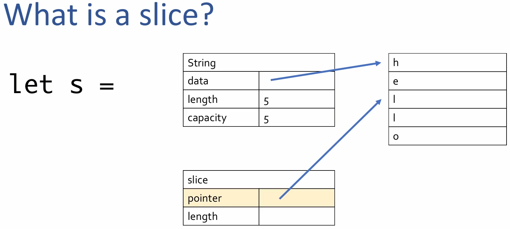
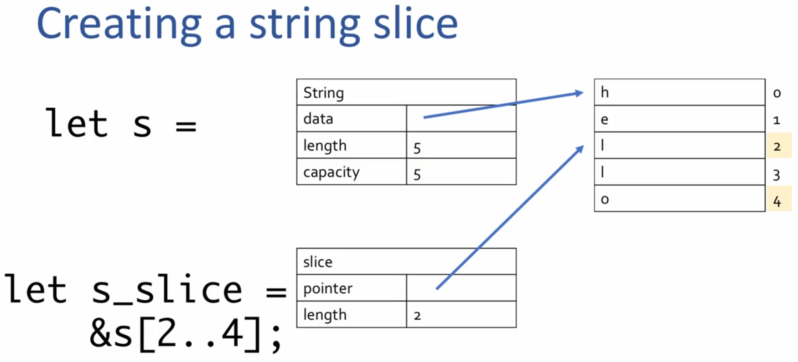

# Owernership and Borrowing

- This ownership and borrowing is a memory management concept that provides memory safety gurantee in Rust

## Ownership

- Definition of ownership
  - Rust's strategy of managing memory
- How ownership differs from:
  - Manual memory management in C
  - Garbage collection in Ruby
- Example: The `String` data type in Rust
  - Moving ownership
    - From one function to another
  - Cloning data
    - Basically duplicating it, to have two separate owners
- Execise with functions and strings

### What is ownership

- It is Rust's strategy for managing data and memory and preventing common problems
- Each piece of data has one owning variable, the memory owner
- Owner is responsible for cleaning up that data and no one else
  - Cleanup happens when the owner goes out of scope
- The owner decides on mutability

### How ownership differs from `C` / `Ruby` / `Rust`

- In `C`
  - *Basically manual memory management*
  - Code has to explicitly has to perform both allocation and deallocation
    - `malloc`, `free`
  - Advantage
    - Complete control over your program memory and how much it uses
  - Disadvantage
    - C doesn't prevent you from messing with pointers
      - Use after free
        - dangling pointers
      - Memory leaks
        - if deallocation is not done by the program
      - Double free
        - Two parts of your program tries to dealloate the same data
  - These disadvantages cause major security flaws and crashes
    - Example: Heartbleed vulnerability

    ```c
    #include <stdio.h>
    #include <stdlib.h>

    typedef struct tagNode {
      char cLeftChannel;
      char cRightChannel;
      char cValue;
    } NODE;

    int main(int argc, char *argv[]) {
      /* manually allocate */
      NODE * pNode = malloc(sizeof(NODE));
      
      pNode->cLeftChannel = 0;
      pNode->cRightChannel = 0;
      pNode->cValue = 10;

      /* manually deallocate */
      free(pNode);

      return 0;
    }
    ```

- In `Ruby`
  - *Basically automatic memory management*
  - It takes care of managing memory
    - By garbage collector
      - It is a component running alongside your program, cleaning up memory that you are done wtih
    - Advantage
      - No need to think about managing memeory at all
      - GC keeps trackof which memory is still in use and cleans up any data that your program is done with
      - And we don't have the disadvantages listed for 'C"
    - Disadvantage
      - Down side of GC is you lose control and performance
        - When GC runs,
          - It takes up computer resources that your program could be using
          - Your program will also likely use more memory than it strictly needs because of the GC (Because GC cleans up only if it is sure that your program is done)
- `Rust`
  - It tries to get the **best of both worlds**
    - Ownership gives you *control over memory allocation*
      - and the associated performance by cleaning up data ***automatically*** when owner goes out of scope
  - We *can't mess up with memory acess*, and
  - We *won't be using memory longer* than we strictly need to

### Example: The String data type

#### String

- It is a type in Rust that has data that needs to be cleaned up when it goes out of scope
- It tracks
  - How much space is allocated
  - how much of that space is used
  - And the UTF-8 data
- When the owner of the string goes out of scope
  - The UTF-8 data needs to be cleaned up

- Creating String

    ```rust
    fn main() {
        let a = String::from("Hi");
        println!("Salutation string {}", a);
    }
    ```

  - `let a = String::from("Hi");`
    - String allocates memory to hold the text "hello"
  - `println!("Salution string {}", a);`
    - It uses the value of `a` for printing
  - When code reaches the closing curly braces `}`
    - At this point, variable `a` goes out of scope
    - The data allocated for `a` is deallocated automatically

  ```rust
  fn main() {
      let mut a = String::from("Hi");
      a.push_str(", Good Morning!!!");
      println!("Salutation string {}", a);
  }

  // Salution string Hi, Good Morning!!!
  ```

  - data can be modified dynamically (variable needs to be mutable `mut`)
    - `a.push_str(", Good Morning!!!");`
      - This will allocate more memory if necessary

### Moving Ownership

- By default, for non-primitive types, rust moves the ownership
- Between variables

    ```rust
    fn main() {
        let a = String::from("Hi");
        let t = a;
        println!("Salution string {}", t);
    }

    // Salution string Hi
    ```

  - `let t = a;`
    - This will move ownership of the string `a` to `t`
      - After this, the variable `a` is no longer available for use
- Between functions

  ```rust
  fn greet(s: String) {
      println!("Hi, {}", s);
  }

  fn main() {
      let a = String::from("Good Morning");
      greet(a);
  }

  // Hi, Good Morning
  ```

  - function `greet` takes ownership of string and prints it out
  - The string `s` gets cleaned-up at the end of function `greet`
- Transferring ownership from function

  ```rust
  fn smiley_open_hands() -> String{
      String::from("🤗")
  }

  fn main() {
      let s = smiley_open_hands();
      println!("String val: {}", s);
  }

  // String val: 🤗
  ```

- Here the ownership of the string created in `smiley_open_hands` is transferred to the function caller
  - It is not cleanedup at the end of the function `smiley_open_hands`
  - Instead ownership is transferred to `a` and it is cleaned-up at the end of `main` when `a` goes out of scope

### Cloning data

- Sometimes we need to keep the ownership of the data but also need to give ownership of the data to another piece of code
  - This is done by *cloning*
- `let t = a.clone();`
  - Cloning makes
    - a deep copy of the allocated memory
    - There is two copies of data owned by each owner `a` and `t` respectively
      - Now each owner has the responsibility to clean up their data
- Cloning is one of the way to overcome errors arised from ownership
  - But we may end up using more memory than we strictly needed

    ```rust
    fn greet(s: String) {
        println!("Hi, {}", s);
    }

    fn main() {
        let a = String::from("Good Morning");
        greet(a.clone());
        println!("Using a again: {}", a);
    }

    // Hi, Good Morning
    // Using a again: Good Morning
    ```

### Fun with functions and strings

```rust
fn main() {
    let s = String::from(:book);

    // Add code here that calls the pluralize function

    println!(
        "I have one {}, you have two {}",
        s,
        you_add_something_ehere,
    );
}

// Add appropriate parameters, return values, and implementations to this function
fn pluralize() {}
```

Solution:

```rust
fn main() {
    let s = String::from("book");

    let pl = pluralize(s.clone());
    println!("I have one {}, you have two {}", s, pl);
}

// Add appropriate parameters, return values, and implementations to this function
fn pluralize(singular: String) -> String {
    singular + "s"
}
```

## Borrowing

- What is borrowing?
  - *Lend out a value instead of transferring ownership*
  - It is a way to allow some code to use a value without moving ownership

    ```rust
    struct Person {
        name: String,
    }

    fn congratulate(person: &Person) {
        println!("Congratulations, {}!!!", person.name)
    }

    fn main() {
        let p = Person {
            name: String::from("Gymk"),
        };

        congratulate(&p);
        println!("Can still use p here: {}", p.name);
    }

    // Congratulations, Gymk!!!
    // Can still use p here: Gymk
    ```

  - In above code, `congratulate` function just reads the person name
  - it doesn't need the ownership, just borrowing it is enough to print it
    - This is indicated by the `&` before the type name
    - Note that also we use `&` in the caller also to indicate that it is a reference
- Why borrow?
  - *Reduce allocations; improve performance*
  - Reason is **performance**
    - Instead of cloning the value, we can give it a reference to use it
    - This avoids cloning, yielding performance
      - That is Rust uses borrowing to reduce the allocations to improve the performance
  - Borrow is a signal of intent
    - If the function signature has `&`, then we can know that the function do not want to change the data of it, instead to use it
      - `pub fn push_str(&mut self, string: &str)`
- Difference between borrowing and pointers in other languages
  - In Rust, *references are always valid*
  - Borowing may feel similar to using pointers in other langauges
    - But there ***are*** important differences in Rust. There is one bug important difference
      - In Safe Rust, the borrow checker ensures at compile time, that you will never have an invalid reference (a reference that points to nothing or to invalid memory)
      - This prevents a lot of bugs
        - Example: Run time bug caused by invalid reference
          - Ex: `C` or `C++`
            - *Segmentation Fault*
          - Ex: `Ruby`
            - *Undefined method on nil*
          - Ex: `JavaScript`
            - *Undefined is not a function*
        - These run time errors happens only in certain circumstances and hard to debug/track down
        - This is avoided by compile time borrow checker in Rust
          - Rust catches these errors every time and won't let you try to even run the code with this problem
  - Example: Trying to create an invalid reference in Rust

    ```rust
    fn name() -> &str {
        let n = String::from("Gymk");
        &n
    }

    fn main() {
        let my_name = name();
    }
    ```

  - In function `name`
    - `n` is the owner of the string that is created
    - and this `n` goes out of scope at the end of the function `name`
  - Rust doesn't allow to return a refernce to `n` which is going to get destroyed
    - Because once out of scope, there is nothing to reference to once the function is over
    - If we were able to, then `my_name` will have an invalid reference
  - *You can't return a reference from a function that points to something that points to something that was created within that function*
  - Solution

    ```rust
    fn name() -> String {
        String::from("Gymk")
    }

    fn main() {
        let my_name = name();
    }
    ```

- Alternate solution to [execise](#fun-with-functions-and-strings)

    ```rust
    fn main() {
        let s = String::from("book");

        let pl = pluralize(&s);
        println!("I have one {}, you have two {}", s, pl);
    }

    // Add appropriate parameters, return values, and implementations to this function
    fn pluralize(singular: &str) -> String {
        singular.to_owned() + "s"
    }

    // I have one book, you have two books
    ```

  - string slices `&str` are borrowed and can't reallocate
    - We are using `to_owned()` to create a new string from the slice and the we perform the string concatenation
  - This solution is not right, even though we removed `clone` during the `pluralize` invokation, but it clones the string inside `pluralize`
    - However, the concern of allocation is moved to pluralize, removing the worry from the caller - a good design approach
      - That is ***encapsulated*** the implementation detail within the `pluralize` function

### Slices

- Slice is a borrowed data

- What is a slice?
  - *Borrow a slice of data*
  - It is a data type that always borrow data owned by some other data structure
  - In below picture,
    - How a slice is stored -> A pointer and length
    - The reference that slice referencess -> a reference to `ll` in the `hello` string
      - 
- How to create a slice from Strings, Vecs, or arrays?
  - `&var[start..end]`
  - `String`
    - `&` and a range `[start_index..end_index]`
    -   
    - If you want to start from index '0', the you can `[..4]`
      - `let s_slice = &s[..4]`
    - If slice goes till end of the data strucut, then you can `[1..]`
      - `let s_slice = &s[1..]`
    - If slice borrows all of the data, then you can `[..]`
      - `let s = &s[..]`
  - array and `Vec`
    - `let a = [0.0, 3.14, -8.7928];`
      - Slice from `a`: `let a_slice = &a[..1];`
    - `let mut v = vec![10, 20, 30]; v.push(40);`
      - Slice from `v`: `let v_slice = &v[1..2];`
- Indices in slices
  - Slices
    - Are always valid references
      - The borrow checker ensures slices are always valid
    - Have their indices checked at runtime
      - But, at run time, Rust will panice and stop your program if slice indices are out of bounds
      - ***This is done at run time, not a compile time***
      - Example:

        ```rust
        fn main () {
            let v= vec![10, 20, 30];
            let v_slice = &v[..9];
            println!("v_slice is {:?}", v_slice);
        }

        // thread 'main' panicked at 'range end index 9 out of range for slice of length 3', src/main.rs:3:20
        // note: run with `RUST_BACKTRACE=1` environment variable to display a backtrace
        ```
  
        - *Slice indices are not analyzed at compile time*
          - Even though out of bound value `9` is used in the range, rust compile won't analyze the indices (as in real use case, the indice range may be dictated by some other variable value)
          - However, rust panics and stops the program, this *prevents the use of invalid memory*, which will lead to *segmentation fault* or *undefined behaviour*.
      - String Slices
        - **It has additional protection**
          - *The character boundaries are checked at run-time*
          - *Must occur at valid Unicode character boundaries*
        - The indices of the slice range must be at valid Unicode character boundaries

          ```rust
          fn main() {
              let s = "😊👍🤣😂";
              let s_slice = &s[0..1];
              println!("s_slice is: {:?}", s_slice);
          }

          // thread 'main' panicked at 'byte index 1 is not a char boundary; it is inside '😊' (bytes 0..4) of `😊👍🤣😂`', src/main.rs:3:20
          // note: run with `RUST_BACKTRACE=1` environment variable to display a backtrace
          ```

          - Each emoji will use multiple byte. The character boundaries are not checked at compile time
        - Use `String` methods instead of indicies
          - user `chars` or `char_indices` to get a slice, ***DO NOT USE indices***
- String Literals
  - String literatls create string slices.
    - The texts that are provided in your compiled program is created as a slice

    ```rust
    fn main() {
        let s = "hello";
    }
    ```

- Why use slices as paramters?
  - *Flexibility*
  - it is better to use a slice or a string slice as parameters to functions or methods, rathen than borrowing a `Vec` , array, or `String`
    - Example - 1: Using array and `Vec`

      ```rust
      fn main() {
          let a = [1, 2, 3];
          let v = vec![4, 5, 6];
          let v_slice = &v[..];

          only_reference_to_araay(&a);
          only_reference_to_vector(&v);
          reference_to_either_array_or_vector(&a[..]);
          reference_to_either_array_or_vector(&v[..]);
          reference_to_either_array_or_vector(&v_slice[0..1]);

      }

      fn only_reference_to_araay(param: &[i32; 3]) {
          println!("This is an array: {:?}", param);
      }

      fn only_reference_to_vector(param: &Vec<i32>) {
          println!("This is a vector: {:?}", param);
      }

      fn reference_to_either_array_or_vector(param: &[i32]) {
          println!("This is a slice: {:?}", param);
      }

      // This is an array: [1, 2, 3]
      // This is a vector: [4, 5, 6]
      // This is a slice: [1, 2, 3]
      // This is a slice: [4, 5, 6]
      // This is a slice: [4]
      ```

      - Using slice as a parameter gives more flexibility of passing both array and vec to the function
        - Enables that function can be used in more contexts
    - Example - 2: Using `String`

      ```rust
      fn main() {
          let s = String::from("hello");
          let string_literal = "hello";

          either_string_or_literal(&s);
          either_string_or_literal(&string_literal);
      }

      fn either_string_or_literal(param: &str) {
          println!("This is a string slice: {:?}", param);
      }

      // This is a string slice: "hello"
      // This is a string slice: "hello"
      ```

      - By specifying a string slice as parameer (rather than borrowing an owned `String`), functions can accept either borrowed strings or string literals
- How does `&String` become `&str`?
  - *`Deref` trait and `Deref coercion` trait*
  - *It is the Rust feature that turn `&String` into `&str`*
    - [`Deref`](https://doc.rust-lang.org/std/ops/trait.Deref.html) trait implemented to convert `&String` to `&str`
      - The Rust standard library includes the implementation of a [**trait**](Traits.md) called **`Deref`** on `String`, which enables Rust to convert `&String`(a reference to a String) into a `&str`(a string slice) containing the whole `String`
    - [`Deref coercion`](https://doc.rust-lang.org/std/ops/trait.Deref.html#more-on-deref-coercion) when calling functions are methods
      - *`Deref coercion` is a Rust future*
        - When you call a function or method, the compiler will automatically dereference the arguments (if need be), to convert them to match the function parameter type
      - This works for arrays and vectors too
